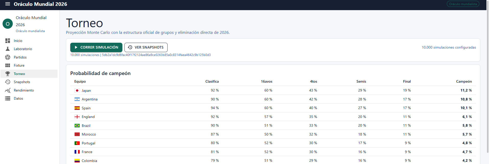

# Oráculo Mundial 2026 🔮

> Un oráculo del Mundial que funciona como huele.

Aplicación web para predecir el Mundial de Fútbol 2026. Construida con .NET 9 y Blazor Server, usa una escalera de modelos estadísticos que va desde un baseline uniforme hasta un modelo de goles con corrección de Dixon-Coles, y corre más de 10.000 simulaciones Monte Carlo del torneo completo.

---

## 🏆 Predicción: Campeón Mundial 2026 — Japón 🇯🇵

> **10.000 simulaciones Monte Carlo. El oráculo habló.**



| Equipo | Clasifica | 16avos | 4tos | Semis | Final | **Campeón** |
|---|---|---|---|---|---|---|
| 🇯🇵 **Japan** | 92% | 60% | 43% | 29% | 19% | **11,2%** |
| 🇦🇷 Argentina | 90% | 60% | 42% | 28% | 17% | 10,8% |
| 🇪🇸 Spain | 94% | 60% | 40% | 27% | 17% | 10,1% |
| 🏴󠁧󠁢󠁥󠁮󠁧󠁿 England | 92% | 57% | 35% | 20% | 11% | 6,1% |
| 🇧🇷 Brazil | 90% | 51% | 33% | 20% | 11% | 5,8% |
| 🇲🇦 Morocco | 87% | 50% | 32% | 18% | 11% | 5,7% |
| 🇵🇹 Portugal | 80% | 52% | 30% | 17% | 9% | 4,8% |
| 🇫🇷 France | 81% | 52% | 30% | 16% | 9% | 4,7% |
| 🇨🇴 Colombia | 79% | 51% | 29% | 16% | 9% | 4,2% |

*Simulación corrida con seed 2026 — reproducible y verificable.*

---

## Cómo correrlo en local

### Requisitos

- [.NET 9 SDK](https://dotnet.microsoft.com/download/dotnet/9.0)

Verificá que lo tenés instalado:
```
dotnet --version
```

### Clonar y correr

```bash
git clone https://github.com/Jeysshonb/oraculo_mundial_2026.git
cd oraculo_mundial_2026
dotnet restore
dotnet run --project OracuMundial2026.Web
```

La primera vez tarda un poco — restaura paquetes, crea la base de datos SQLite e importa los datos de seed. Cuando veas esto en la consola, está listo:

```
Now listening on: http://localhost:5000
```

Abrí el navegador en `http://localhost:5000`.

---

## Cómo hacer tus predicciones

### Paso 1 — Actualizar los datos de rankings (opcional pero recomendado)

Al iniciar, la app intenta refrescar automáticamente los rankings FIFA y Elo desde internet (`RankingRefreshOnStartup: true`). Si querés forzar la actualización manualmente:

1. Andá a **`/datos`** (menú "Datos")
2. Hacé clic en **"Actualizar rankings"**

Esto descarga los últimos rankings FIFA y ratings Elo y los guarda en los CSVs locales.

### Paso 2 — Ver las predicciones de los partidos

1. Andá a **`/partidos`** (menú "Partidos")
2. Vas a ver todos los fixtures del grupo con las predicciones del oráculo
3. Cada partido muestra la predicción del modelo más completo disponible (escalera de modelos)
4. Podés guardar un snapshot de las predicciones actuales con el botón **"Guardar snapshot"**

### Paso 3 — Comparar dos equipos en el Laboratorio

1. Andá a **`/lab`** (menú "Laboratorio")
2. Seleccioná los dos equipos que querés comparar
3. Vas a ver cómo cada nivel de la escalera predice ese partido:
   - **Nivel 0** — Baseline uniforme (50/50)
   - **Nivel 1** — Rankings FIFA
   - **Nivel 2** — Ratings Elo
   - **Nivel 3** — Forma reciente
   - **Nivel 4** — Modelo de goles (Poisson + Dixon-Coles)
   - **Nivel 5** — Modelo de goles + disponibilidad de jugadores
   - **Oráculo final** — El nivel más alto usable con calibración Elo/FIFA

### Paso 4 — Simular el torneo completo

1. Andá a **`/torneo`** (menú "Torneo")
2. Hacé clic en **"Correr simulación"**
3. La app corre 10.000 simulaciones Monte Carlo y te muestra la probabilidad de que cada equipo gane el torneo, llegue a semifinales, etc.
4. Podés guardar esa proyección como snapshot para comparar después

### Paso 5 — Cargar resultados reales y evaluar

Cuando se jueguen los partidos:

1. En **`/partidos`**, buscá el partido jugado y cargá el resultado (goles local/visitante)
2. Andá a **`/rendimiento`** para ver qué tan bien predijo el oráculo:
   - **Brier score** — error cuadrático medio de las probabilidades
   - **RPS** — Ranked Probability Score
   - **Log loss** — pérdida logarítmica
   - **Precisión top-pick** — cuántas veces acertó el resultado predicho

### Paso 6 — Noticias de lesiones y disponibilidad (opcional)

Si tenés una API key de OpenRouter:

1. En **`/datos`**, hacé clic en **"Actualizar disponibilidad"**
2. La app scrapea ESPN y TalkSport, clasifica las noticias de lesiones y ajusta las predicciones automáticamente

Sin la key, las predicciones igual funcionan — solo no consideran lesiones.

---

## Configuración de claves API (opcional)

Las keys van en `OracuMundial2026.Web/appsettings.Development.json` (no en el repo):

```json
{
  "OracuMundial2026": {
    "ApiFootballApiKey": "tu-key-de-api-football",
    "OpenRouterApiKey": "tu-key-de-openrouter"
  }
}
```

Sin estas keys la app funciona igual — solo perdés el refresco automático de fixtures y el análisis de lesiones.

---

## Pantallas disponibles

| Ruta | Descripción |
|---|---|
| `/` | Vista general y escalera de modelos |
| `/lab` | Comparar dos equipos en la escalera |
| `/partidos` | Fixtures, predicciones y carga de resultados |
| `/fixture` | Fixture completo del torneo |
| `/torneo` | Simulación Monte Carlo del torneo |
| `/torneo/snapshots` | Proyecciones guardadas |
| `/rendimiento` | Métricas de evaluación |
| `/datos` | Importar CSVs, refrescar rankings y disponibilidad |

---

## Stack

| Tecnología | Uso |
|---|---|
| .NET 9 + Blazor Server | Framework y UI |
| MudBlazor | Componentes Material Design |
| Entity Framework Core 9 + SQLite | Base de datos |
| CsvHelper | Parseo de seed data |
| xUnit | Tests |
| API-Football | Datos de fixtures y contexto (opcional) |
| OpenRouter | Clasificación de lesiones (opcional) |

---

## Estructura del proyecto

```
OracuMundial2026.sln
OracuMundial2026.Web/
  Components/       Páginas Blazor, layout y UI compartida
  DAL/              DbContext de EF Core
  Data/             CSVs de seed data
  Helpers/          Parseo CSV, normalización de nombres, helpers
  Models/           Modelos de dominio, CSV, API y evaluación
  Predictors/       Escalera de modelos y selector final
  Probability/      Matemática de probabilidades y métricas
  Services/         Importación, predicción, rankings, API, simulación
    Simulation/     Bracket del Mundial 2026 y motor Monte Carlo
OracuMundial2026.Web.Tests/   Tests unitarios xUnit
```

---

## Tests

```bash
dotnet test
```

---

## Datos de seed

CSVs en `OracuMundial2026.Web/Data/`:

| Archivo | Contenido |
|---|---|
| `wc2026_groups.csv` | Grupos y equipos del torneo |
| `historical_results.csv` | Resultados históricos de selecciones |
| `fifa_rankings.csv` | Snapshot de rankings FIFA |
| `elo_snapshot.csv` | Snapshot de ratings Elo |
