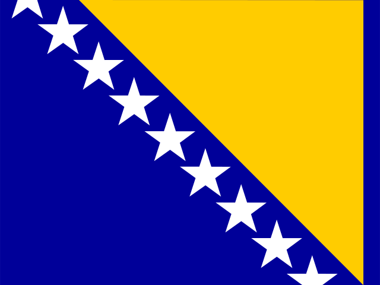

# Oráculo Mundial 2026 🔮

> Un oráculo del Mundial que funciona como huele.

App en .NET 9 + Blazor Server para predecir el Mundial 2026. Usa una escalera de modelos (FIFA, Elo, forma, goles) y corre +10.000 simulaciones Monte Carlo del torneo. Las predicciones se ajustan según goles, lesiones y rankings reales.

---
---

## Cómo correrlo en local

Requisitos: [.NET 9 SDK](https://dotnet.microsoft.com/download/dotnet/9.0)

```bash
git clone https://github.com/Jeysshonb/oraculo_mundial_2026.git
cd oraculo_mundial_2026
dotnet restore
dotnet run --project OracuMundial2026.Web
```

Abrí `http://localhost:5235` cuando veas `Now listening on...`.

## Cómo hacer tus predicciones

1. **`/datos`** → "Actualizar rankings" para traer FIFA/Elo al día.
2. **`/partidos`** → predicciones de cada partido del grupo.
3. **`/lab`** → comparar dos equipos en toda la escalera de modelos.
4. **`/torneo`** → "Correr simulación" para ver probabilidades de campeón (10.000 simulaciones).
5. **`/rendimiento`** → qué tan bien predijo (Brier, RPS, log loss, top-pick).

## Stack

.NET 9 · Blazor Server · MudBlazor · EF Core 9 · SQLite · CsvHelper · xUnit · API-Football (opcional) · OpenRouter (opcional)

## Estructura

```
OracuMundial2026.sln
OracuMundial2026.Web/        App: Components, DAL, Data, Helpers, Models, Predictors, Probability, Services
OracuMundial2026.Web.Tests/  Tests xUnit
```

## Tests

```bash
dotnet test
```

## Datos

CSVs en `OracuMundial2026.Web/Data/`: grupos, resultados históricos, goleadores, rankings FIFA y Elo.

<!-- oracumundial2026:snapshots:start -->
## Predicciones más recientes
_A medida que se recibe nueva información y se juegan partidos reales, el Oloráculo ajusta sus predicciones y las publica acá. A continuación vas a encontrar las más recientes._

### Torneo

_Generado 2026-06-27 14:00 UTC a través de 10,000 simulaciones._

| Equipo | Grupo | Clasifica | 4tos | Semis | Final | Campeón |
| --- | --- | ---: | ---: | ---: | ---: | ---: |
|  Argentina | J | 100 % | 77 % | 57 % | 41 % | **28.6 %** |
|  Morocco | C | 100 % | 51 % | 33 % | 20 % | **10.4 %** |
|  Spain | H | 100 % | 45 % | 33 % | 20 % | **9.9 %** |
|  Japan | F | 100 % | 38 % | 24 % | 12 % | **6.8 %** |
|  Colombia | K | 100 % | 48 % | 23 % | 13 % | **6.2 %** |
|  Brazil | C | 100 % | 34 % | 21 % | 9 % | **5.3 %** |
|  England | L | 100 % | 40 % | 22 % | 10 % | **5.3 %** |
|  Portugal | K | 100 % | 36 % | 19 % | 10 % | **4.5 %** |
|  France | I | 100 % | 43 % | 22 % | 11 % | **4.5 %** |
|  Germany | E | 100 % | 47 % | 21 % | 9 % | **3.2 %** |
|  Netherlands | F | 100 % | 22 % | 11 % | 5 % | **1.9 %** |
|  Ecuador | E | 100 % | 28 % | 12 % | 4 % | **1.8 %** |
|  Australia | D | 100 % | 15 % | 7 % | 3 % | **1.3 %** |
|  Senegal | I | 100 % | 25 % | 9 % | 3 % | **1.2 %** |
|  Belgium | G | 100 % | 28 % | 10 % | 4 % | **1.1 %** |
|  Mexico | A | 100 % | 26 % | 9 % | 3 % | **1.1 %** |

### Grupos

<details open>
<summary><strong>Group A</strong></summary>

| Partido | Estado | Resultado / Predicción | Por qué | L | E | V |
| --- | --- | --- | --- | ---: | ---: | ---: |
|  South Africa vs  Czechia | FT · 18 Jun 2026 | Real **1-1** <br><sub>Predicción: 1-1</sub> | Model: Or&#225;culo final<br>Signals: Fuerza de ataque ajustada por rival, Vulnerabilidad defensiva ajustada por rival, Grilla de marcadores Dixon-Coles, Marcador m&#225;s probable: 1-1 | 33 % | 28 % | 39 % |
|  Mexico vs  South Korea | FT · 19 Jun 2026 | Real **1-0** <br><sub>Predicción: 1-1</sub> | Model: Or&#225;culo final<br>Signals: Fuerza de ataque ajustada por rival, Vulnerabilidad defensiva ajustada por rival, Grilla de marcadores Dixon-Coles, Marcador m&#225;s probable: 1-1 | 38 % | 28 % | 34 % |
|  Mexico vs  Czechia | FT · 25 Jun 2026 | Real **3-0** <br><sub>Predicción: 2-1</sub> | Model: Or&#225;culo final<br>Signals: Fuerza de ataque ajustada por rival, Vulnerabilidad defensiva ajustada por rival, Grilla de marcadores Dixon-Coles, Marcador m&#225;s probable: 1-0 | 52 % | 26 % | 22 % |
|  South Africa vs  South Korea | FT · 25 Jun 2026 | Real **1-0** <br><sub>Predicción: 1-2</sub> | Model: Or&#225;culo final<br>Signals: Fuerza de ataque ajustada por rival, Vulnerabilidad defensiva ajustada por rival, Grilla de marcadores Dixon-Coles, Marcador m&#225;s probable: 0-1 | 22 % | 26 % | 53 % |
|  Mexico vs  South Africa | FT | Real **2-0** <br><sub>Predicción: 1-1</sub> | Model: Or&#225;culo final<br>Signals: Fuerza de ataque ajustada por rival, Vulnerabilidad defensiva ajustada por rival, Grilla de marcadores Dixon-Coles, Marcador m&#225;s probable: 1-0 | 52 % | 28 % | 20 % |
|  South Korea vs  Czechia | FT | Real **2-1** <br><sub>Predicción: 2-1</sub> | Model: Or&#225;culo final<br>Signals: Fuerza de ataque ajustada por rival, Vulnerabilidad defensiva ajustada por rival, Grilla de marcadores Dixon-Coles, Marcador m&#225;s probable: 1-1 | 52 % | 24 % | 24 % |

</details>

<details open>
<summary><strong>Group B</strong></summary>

| Partido | Estado | Resultado / Predicción | Por qué | L | E | V |
| --- | --- | --- | --- | ---: | ---: | ---: |
|  Qatar vs  Switzerland | FT · 13 Jun 2026 | Real **1-1** <br><sub>Predicción: 1-2</sub> | Model: Or&#225;culo final<br>Signals: Fuerza de ataque ajustada por rival, Vulnerabilidad defensiva ajustada por rival, Grilla de marcadores Dixon-Coles, Marcador m&#225;s probable: 0-2 | 15 % | 19 % | 67 % |
|  Bosnia and Herzegovina vs  Switzerland | FT · 18 Jun 2026 | Real **1-4** <br><sub>Predicción: 1-2</sub> | Model: Or&#225;culo final<br>Signals: Fuerza de ataque ajustada por rival, Vulnerabilidad defensiva ajustada por rival, Grilla de marcadores Dixon-Coles, Marcador m&#225;s probable: 0-2 | 11 % | 18 % | 71 % |
|  Canada vs  Qatar | FT · 18 Jun 2026 | Real **6-0** <br><sub>Predicción: 2-1</sub> | Model: Or&#225;culo final<br>Signals: Fuerza de ataque ajustada por rival, Vulnerabilidad defensiva ajustada por rival, Grilla de marcadores Dixon-Coles, Marcador m&#225;s probable: 1-0 | 64 % | 21 % | 15 % |
|  Bosnia and Herzegovina vs  Qatar | FT · 24 Jun 2026 | Real **3-1** <br><sub>Predicción: 1-2</sub> | Model: Or&#225;culo final<br>Signals: Fuerza de ataque ajustada por rival, Vulnerabilidad defensiva ajustada por rival, Grilla de marcadores Dixon-Coles, Marcador m&#225;s probable: 1-1 | 29 % | 25 % | 46 % |
|  Canada vs  Switzerland | FT · 24 Jun 2026 | Real **1-2** <br><sub>Predicción: 1-1</sub> | Model: Or&#225;culo final<br>Signals: Fuerza de ataque ajustada por rival, Vulnerabilidad defensiva ajustada por rival, Grilla de marcadores Dixon-Coles, Marcador m&#225;s probable: 1-1, +1 more | 35 % | 28 % | 37 % |
|  Canada vs  Bosnia and Herzegovina | FT | Real **1-1** <br><sub>Predicción: 2-1</sub> | Model: Or&#225;culo final<br>Signals: Fuerza de ataque ajustada por rival, Vulnerabilidad defensiva ajustada por rival, Grilla de marcadores Dixon-Coles, Marcador m&#225;s probable: 1-0 | 68 % | 21 % | 11 % |

</details>

<details open>
<summary><strong>Group C</strong></summary>

| Partido | Estado | Resultado / Predicción | Por qué | L | E | V |
| --- | --- | --- | --- | ---: | ---: | ---: |
|  Brazil vs  Morocco | FT · 13 Jun 2026 | Real **1-1** <br><sub>Predicción: 1-1</sub> | Model: Or&#225;culo final<br>Signals: Fuerza de ataque ajustada por rival, Vulnerabilidad defensiva ajustada por rival, Grilla de marcadores Dixon-Coles, Marcador m&#225;s probable: 1-1, +1 more | 33 % | 30 % | 37 % |
|  Haiti vs  Scotland | FT · 14 Jun 2026 | Real **0-1** <br><sub>Predicción: 1-2</sub> | Model: Or&#225;culo final<br>Signals: Fuerza de ataque ajustada por rival, Vulnerabilidad defensiva ajustada por rival, Grilla de marcadores Dixon-Coles, Marcador m&#225;s probable: 1-1 | 31 % | 24 % | 45 % |
|  Morocco vs  Scotland | FT · 19 Jun 2026 | Real **1-0** <br><sub>Predicción: 2-1</sub> | Model: Or&#225;culo final<br>Signals: Fuerza de ataque ajustada por rival, Vulnerabilidad defensiva ajustada por rival, Grilla de marcadores Dixon-Coles, Marcador m&#225;s probable: 1-0 | 65 % | 23 % | 12 % |
|  Brazil vs  Haiti | FT · 20 Jun 2026 | Real **3-0** <br><sub>Predicción: 3-1</sub> | Model: Or&#225;culo final<br>Signals: Fuerza de ataque ajustada por rival, Vulnerabilidad defensiva ajustada por rival, Grilla de marcadores Dixon-Coles, Marcador m&#225;s probable: 2-0 | 79 % | 13 % | 8 % |
|  Brazil vs  Scotland | FT · 24 Jun 2026 | Real **3-0** <br><sub>Predicción: 2-1</sub> | Model: Or&#225;culo final<br>Signals: Fuerza de ataque ajustada por rival, Vulnerabilidad defensiva ajustada por rival, Grilla de marcadores Dixon-Coles, Marcador m&#225;s probable: 2-0 | 70 % | 18 % | 12 % |
|  Morocco vs  Haiti | FT · 24 Jun 2026 | Real **4-2** <br><sub>Predicción: 2-1</sub> | Model: Or&#225;culo final<br>Signals: Fuerza de ataque ajustada por rival, Vulnerabilidad defensiva ajustada por rival, Grilla de marcadores Dixon-Coles, Marcador m&#225;s probable: 2-0 | 73 % | 18 % | 9 % |

</details>

<details open>
<summary><strong>Group D</strong></summary>

| Partido | Estado | Resultado / Predicción | Por qué | L | E | V |
| --- | --- | --- | --- | ---: | ---: | ---: |
|  United States vs  Paraguay | FT · 13 Jun 2026 | Real **4-1** <br><sub>Predicción: 1-1</sub> | Model: Or&#225;culo final<br>Signals: Fuerza de ataque ajustada por rival, Vulnerabilidad defensiva ajustada por rival, Grilla de marcadores Dixon-Coles, Marcador m&#225;s probable: 1-1 | 43 % | 28 % | 29 % |
|  Australia vs  Turkey | FT · 14 Jun 2026 | Real **2-0** <br><sub>Predicción: 2-1</sub> | Model: Or&#225;culo final<br>Signals: Fuerza de ataque ajustada por rival, Vulnerabilidad defensiva ajustada por rival, Grilla de marcadores Dixon-Coles, Marcador m&#225;s probable: 1-1, +1 more | 50 % | 26 % | 25 % |
|  United States vs  Australia | FT · 19 Jun 2026 | Real **2-0** <br><sub>Predicción: 1-1</sub> | Model: Or&#225;culo final<br>Signals: Fuerza de ataque ajustada por rival, Vulnerabilidad defensiva ajustada por rival, Grilla de marcadores Dixon-Coles, Marcador m&#225;s probable: 1-1 | 32 % | 27 % | 41 % |
|  Paraguay vs  Turkey | FT · 20 Jun 2026 | Real **1-0** <br><sub>Predicción: 1-1</sub> | Model: Or&#225;culo final<br>Signals: Fuerza de ataque ajustada por rival, Vulnerabilidad defensiva ajustada por rival, Grilla de marcadores Dixon-Coles, Marcador m&#225;s probable: 1-1, +1 more | 37 % | 28 % | 34 % |
|  Paraguay vs  Australia | FT · 26 Jun 2026 | Real **0-0** <br><sub>Predicción: 1-1</sub> | Model: Or&#225;culo final<br>Signals: Fuerza de ataque ajustada por rival, Vulnerabilidad defensiva ajustada por rival, Grilla de marcadores Dixon-Coles, Marcador m&#225;s probable: 0-1 | 24 % | 30 % | 45 % |
|  United States vs  Turkey | FT · 26 Jun 2026 | Real **2-3** <br><sub>Predicción: 2-1</sub> | Model: Or&#225;culo final<br>Signals: Fuerza de ataque ajustada por rival, Vulnerabilidad defensiva ajustada por rival, Grilla de marcadores Dixon-Coles, Marcador m&#225;s probable: 1-1 | 50 % | 23 % | 27 % |

</details>

<details open>
<summary><strong>Group E</strong></summary>

| Partido | Estado | Resultado / Predicción | Por qué | L | E | V |
| --- | --- | --- | --- | ---: | ---: | ---: |
|  Germany vs  Curacao | FT · 14 Jun 2026 | Real **7-1** <br><sub>Predicción: 3-1</sub> | Model: Or&#225;culo final<br>Signals: Fuerza de ataque ajustada por rival, Vulnerabilidad defensiva ajustada por rival, Grilla de marcadores Dixon-Coles, Marcador m&#225;s probable: 2-0 | 80 % | 12 % | 7 % |
|  Ivory Coast vs  Ecuador | FT · 14 Jun 2026 | Real **1-0** <br><sub>Predicción: 1-1</sub> | Model: Or&#225;culo final<br>Signals: Fuerza de ataque ajustada por rival, Vulnerabilidad defensiva ajustada por rival, Grilla de marcadores Dixon-Coles, Marcador m&#225;s probable: 0-0 | 25 % | 36 % | 39 % |
|  Germany vs  Ivory Coast | FT · 20 Jun 2026 | Real **2-1** <br><sub>Predicción: 1-1</sub> | Model: Or&#225;culo final<br>Signals: Fuerza de ataque ajustada por rival, Vulnerabilidad defensiva ajustada por rival, Grilla de marcadores Dixon-Coles, Marcador m&#225;s probable: 1-1 | 47 % | 26 % | 28 % |
|  Curacao vs  Ecuador | FT · 21 Jun 2026 | Real **0-0** <br><sub>Predicción: 0-2</sub> | Model: Or&#225;culo final<br>Signals: Fuerza de ataque ajustada por rival, Vulnerabilidad defensiva ajustada por rival, Grilla de marcadores Dixon-Coles, Marcador m&#225;s probable: 0-1 | 10 % | 22 % | 68 % |
|  Curacao vs  Ivory Coast | FT · 25 Jun 2026 | Real **0-2** <br><sub>Predicción: 1-2</sub> | Model: Or&#225;culo final<br>Signals: Fuerza de ataque ajustada por rival, Vulnerabilidad defensiva ajustada por rival, Grilla de marcadores Dixon-Coles, Marcador m&#225;s probable: 0-1 | 14 % | 22 % | 64 % |
|  Germany vs  Ecuador | FT · 25 Jun 2026 | Real **1-2** <br><sub>Predicción: 1-1</sub> | Model: Or&#225;culo final<br>Signals: Fuerza de ataque ajustada por rival, Vulnerabilidad defensiva ajustada por rival, Grilla de marcadores Dixon-Coles, Marcador m&#225;s probable: 1-1, +1 more | 36 % | 31 % | 34 % |

</details>

<details open>
<summary><strong>Group F</strong></summary>

| Partido | Estado | Resultado / Predicción | Por qué | L | E | V |
| --- | --- | --- | --- | ---: | ---: | ---: |
|  Netherlands vs  Japan | FT · 14 Jun 2026 | Real **2-2** <br><sub>Predicción: 1-2</sub> | Model: Or&#225;culo final<br>Signals: Fuerza de ataque ajustada por rival, Vulnerabilidad defensiva ajustada por rival, Grilla de marcadores Dixon-Coles, Marcador m&#225;s probable: 1-1, +1 more | 29 % | 26 % | 46 % |
|  Sweden vs  Tunisia | FT · 15 Jun 2026 | Real **5-1** <br><sub>Predicción: 1-1</sub> | Model: Or&#225;culo final<br>Signals: Fuerza de ataque ajustada por rival, Vulnerabilidad defensiva ajustada por rival, Grilla de marcadores Dixon-Coles, Marcador m&#225;s probable: 1-1, +1 more | 34 % | 28 % | 38 % |
|  Netherlands vs  Sweden | FT · 20 Jun 2026 | Real **5-1** <br><sub>Predicción: 2-1</sub> | Model: Or&#225;culo final<br>Signals: Fuerza de ataque ajustada por rival, Vulnerabilidad defensiva ajustada por rival, Grilla de marcadores Dixon-Coles, Marcador m&#225;s probable: 2-1 | 66 % | 18 % | 16 % |
|  Japan vs  Tunisia | FT · 21 Jun 2026 | Real **4-0** <br><sub>Predicción: 2-1</sub> | Model: Or&#225;culo final<br>Signals: Fuerza de ataque ajustada por rival, Vulnerabilidad defensiva ajustada por rival, Grilla de marcadores Dixon-Coles, Marcador m&#225;s probable: 1-0 | 62 % | 24 % | 14 % |
|  Japan vs  Sweden | FT · 25 Jun 2026 | Real **1-1** <br><sub>Predicción: 3-1</sub> | Model: Or&#225;culo final<br>Signals: Fuerza de ataque ajustada por rival, Vulnerabilidad defensiva ajustada por rival, Grilla de marcadores Dixon-Coles, Marcador m&#225;s probable: 2-0 | 75 % | 15 % | 10 % |
|  Netherlands vs  Tunisia | FT · 25 Jun 2026 | Real **3-1** <br><sub>Predicción: 2-1</sub> | Model: Or&#225;culo final<br>Signals: Fuerza de ataque ajustada por rival, Vulnerabilidad defensiva ajustada por rival, Grilla de marcadores Dixon-Coles, Marcador m&#225;s probable: 1-0 | 54 % | 25 % | 20 % |

</details>

<details open>
<summary><strong>Group G</strong></summary>

| Partido | Estado | Resultado / Predicción | Por qué | L | E | V |
| --- | --- | --- | --- | ---: | ---: | ---: |
|  Belgium vs  Egypt | FT · 15 Jun 2026 | Real **1-1** <br><sub>Predicción: 1-1</sub> | Model: Or&#225;culo final<br>Signals: Fuerza de ataque ajustada por rival, Vulnerabilidad defensiva ajustada por rival, Grilla de marcadores Dixon-Coles, Marcador m&#225;s probable: 1-0 | 43 % | 29 % | 28 % |
|  Iran vs  New Zealand | FT · 16 Jun 2026 | Real **2-2** <br><sub>Predicción: 2-1</sub> | Model: Or&#225;culo final<br>Signals: Fuerza de ataque ajustada por rival, Vulnerabilidad defensiva ajustada por rival, Grilla de marcadores Dixon-Coles, Marcador m&#225;s probable: 1-0 | 52 % | 25 % | 23 % |
|  Belgium vs  Iran | FT · 21 Jun 2026 | Real **0-0** <br><sub>Predicción: 1-1</sub> | Model: Or&#225;culo final<br>Signals: Fuerza de ataque ajustada por rival, Vulnerabilidad defensiva ajustada por rival, Grilla de marcadores Dixon-Coles, Marcador m&#225;s probable: 1-1, +1 more | 37 % | 27 % | 36 % |
|  Egypt vs  New Zealand | FT · 22 Jun 2026 | Real **3-1** <br><sub>Predicción: 1-1</sub> | Model: Or&#225;culo final<br>Signals: Fuerza de ataque ajustada por rival, Vulnerabilidad defensiva ajustada por rival, Grilla de marcadores Dixon-Coles, Marcador m&#225;s probable: 1-0 | 40 % | 30 % | 31 % |
|  Belgium vs  New Zealand | FT · 27 Jun 2026 | Real **5-1** <br><sub>Predicción: 2-1</sub> | Model: Or&#225;culo final<br>Signals: Fuerza de ataque ajustada por rival, Vulnerabilidad defensiva ajustada por rival, Grilla de marcadores Dixon-Coles, Marcador m&#225;s probable: 1-1 | 51 % | 24 % | 24 % |
|  Egypt vs  Iran | FT · 27 Jun 2026 | Real **1-1** <br><sub>Predicción: 1-1</sub> | Model: Or&#225;culo final<br>Signals: Fuerza de ataque ajustada por rival, Vulnerabilidad defensiva ajustada por rival, Grilla de marcadores Dixon-Coles, Marcador m&#225;s probable: 0-1 | 27 % | 30 % | 44 % |

</details>

<details open>
<summary><strong>Group H</strong></summary>

| Partido | Estado | Resultado / Predicción | Por qué | L | E | V |
| --- | --- | --- | --- | ---: | ---: | ---: |
|  Saudi Arabia vs  Uruguay | FT · 15 Jun 2026 | Real **1-1** <br><sub>Predicción: 1-1</sub> | Model: Or&#225;culo final<br>Signals: Fuerza de ataque ajustada por rival, Vulnerabilidad defensiva ajustada por rival, Grilla de marcadores Dixon-Coles, Marcador m&#225;s probable: 0-1 | 17 % | 31 % | 52 % |
|  Spain vs  Saudi Arabia | FT · 21 Jun 2026 | Real **4-0** <br><sub>Predicción: 2-1</sub> | Model: Or&#225;culo final<br>Signals: Fuerza de ataque ajustada por rival, Vulnerabilidad defensiva ajustada por rival, Grilla de marcadores Dixon-Coles, Marcador m&#225;s probable: 2-0 | 71 % | 19 % | 10 % |
|  Cape Verde vs  Uruguay | FT · 21 Jun 2026 | Real **2-2** <br><sub>Predicción: 1-2</sub> | Model: Or&#225;culo final<br>Signals: Fuerza de ataque ajustada por rival, Vulnerabilidad defensiva ajustada por rival, Grilla de marcadores Dixon-Coles, Marcador m&#225;s probable: 0-1 | 13 % | 26 % | 61 % |
|  Cape Verde vs  Saudi Arabia | FT · 27 Jun 2026 | Real **0-0** <br><sub>Predicción: 1-1</sub> | Model: Or&#225;culo final<br>Signals: Fuerza de ataque ajustada por rival, Vulnerabilidad defensiva ajustada por rival, Grilla de marcadores Dixon-Coles, Marcador m&#225;s probable: 0-1 | 28 % | 31 % | 41 % |
|  Spain vs  Uruguay | FT · 27 Jun 2026 | Real **1-0** <br><sub>Predicción: 1-1</sub> | Model: Or&#225;culo final<br>Signals: Fuerza de ataque ajustada por rival, Vulnerabilidad defensiva ajustada por rival, Grilla de marcadores Dixon-Coles, Marcador m&#225;s probable: 1-0 | 47 % | 29 % | 24 % |
|  Spain vs  Cape Verde | FT | Real **0-0** <br><sub>Predicción: 3-1</sub> | Model: Or&#225;culo final<br>Signals: Fuerza de ataque ajustada por rival, Vulnerabilidad defensiva ajustada por rival, Grilla de marcadores Dixon-Coles, Marcador m&#225;s probable: 2-0 | 80 % | 14 % | 6 % |

</details>

<details open>
<summary><strong>Group I</strong></summary>

| Partido | Estado | Resultado / Predicción | Por qué | L | E | V |
| --- | --- | --- | --- | ---: | ---: | ---: |
|  France vs  Senegal | FT · 16 Jun 2026 | Real **3-1** <br><sub>Predicción: 1-1</sub> | Model: Or&#225;culo final<br>Signals: Fuerza de ataque ajustada por rival, Vulnerabilidad defensiva ajustada por rival, Grilla de marcadores Dixon-Coles, Marcador m&#225;s probable: 1-1 | 44 % | 27 % | 29 % |
|  Iraq vs  Norway | FT · 16 Jun 2026 | Real **1-4** <br><sub>Predicción: 1-2</sub> | Model: Or&#225;culo final<br>Signals: Fuerza de ataque ajustada por rival, Vulnerabilidad defensiva ajustada por rival, Grilla de marcadores Dixon-Coles, Marcador m&#225;s probable: 0-1 | 20 % | 25 % | 55 % |
|  France vs  Iraq | FT · 22 Jun 2026 | Real **3-0** <br><sub>Predicción: 2-1</sub> | Model: Or&#225;culo final<br>Signals: Fuerza de ataque ajustada por rival, Vulnerabilidad defensiva ajustada por rival, Grilla de marcadores Dixon-Coles, Marcador m&#225;s probable: 1-0 | 61 % | 24 % | 15 % |
|  Senegal vs  Norway | FT · 23 Jun 2026 | Real **2-3** <br><sub>Predicción: 1-1</sub> | Model: Or&#225;culo final<br>Signals: Fuerza de ataque ajustada por rival, Vulnerabilidad defensiva ajustada por rival, Grilla de marcadores Dixon-Coles, Marcador m&#225;s probable: 1-1 | 37 % | 26 % | 37 % |
|  France vs  Norway | FT · 26 Jun 2026 | Real **4-1** <br><sub>Predicción: 2-1</sub> | Model: Or&#225;culo final<br>Signals: Fuerza de ataque ajustada por rival, Vulnerabilidad defensiva ajustada por rival, Grilla de marcadores Dixon-Coles, Marcador m&#225;s probable: 1-1 | 46 % | 25 % | 30 % |
|  Senegal vs  Iraq | FT · 26 Jun 2026 | Real **5-0** <br><sub>Predicción: 1-1</sub> | Model: Or&#225;culo final<br>Signals: Fuerza de ataque ajustada por rival, Vulnerabilidad defensiva ajustada por rival, Grilla de marcadores Dixon-Coles, Marcador m&#225;s probable: 1-0 | 52 % | 28 % | 20 % |

</details>

<details open>
<summary><strong>Group J</strong></summary>

| Partido | Estado | Resultado / Predicción | Por qué | L | E | V |
| --- | --- | --- | --- | ---: | ---: | ---: |
|  Argentina vs  Algeria | FT · 17 Jun 2026 | Real **3-0** <br><sub>Predicción: 2-1</sub> | Model: Or&#225;culo final<br>Signals: Fuerza de ataque ajustada por rival, Vulnerabilidad defensiva ajustada por rival, Grilla de marcadores Dixon-Coles, Marcador m&#225;s probable: 1-0 | 60 % | 24 % | 16 % |
|  Austria vs  Jordan | FT · 17 Jun 2026 | Real **3-1** <br><sub>Predicción: 2-1</sub> | Model: Or&#225;culo final<br>Signals: Fuerza de ataque ajustada por rival, Vulnerabilidad defensiva ajustada por rival, Grilla de marcadores Dixon-Coles, Marcador m&#225;s probable: 1-1 | 50 % | 24 % | 26 % |
|  Argentina vs  Austria | FT · 22 Jun 2026 | Real **2-0** <br><sub>Predicción: 2-1</sub> | Model: Or&#225;culo final<br>Signals: Fuerza de ataque ajustada por rival, Vulnerabilidad defensiva ajustada por rival, Grilla de marcadores Dixon-Coles, Marcador m&#225;s probable: 1-0 | 65 % | 23 % | 13 % |
|  Algeria vs  Jordan | FT · 23 Jun 2026 | Real **2-1** <br><sub>Predicción: 2-1</sub> | Model: Or&#225;culo final<br>Signals: Fuerza de ataque ajustada por rival, Vulnerabilidad defensiva ajustada por rival, Grilla de marcadores Dixon-Coles, Marcador m&#225;s probable: 1-1 | 58 % | 22 % | 20 % |
|  Algeria vs  Austria | 28 Jun 02:00 UTC | Predicción: 1-1 | Model: Or&#225;culo final<br>Signals: Fuerza de ataque ajustada por rival, Vulnerabilidad defensiva ajustada por rival, Grilla de marcadores Dixon-Coles, Marcador m&#225;s probable: 1-1, +1 more | 41 % | 28 % | 31 % |
|  Argentina vs  Jordan | 28 Jun 02:00 UTC | Predicción: 3-1 | Model: Or&#225;culo final<br>Signals: Fuerza de ataque ajustada por rival, Vulnerabilidad defensiva ajustada por rival, Grilla de marcadores Dixon-Coles, Marcador m&#225;s probable: 2-0 | 79 % | 14 % | 7 % |

</details>

<details open>
<summary><strong>Group K</strong></summary>

| Partido | Estado | Resultado / Predicción | Por qué | L | E | V |
| --- | --- | --- | --- | ---: | ---: | ---: |
|  Portugal vs  Congo DR | FT · 17 Jun 2026 | Real **1-1** <br><sub>Predicción: 1-1</sub> | Model: Or&#225;culo final<br>Signals: Fuerza de ataque ajustada por rival, Vulnerabilidad defensiva ajustada por rival, Grilla de marcadores Dixon-Coles, Marcador m&#225;s probable: 1-0 | 52 % | 29 % | 19 % |
|  Uzbekistan vs  Colombia | FT · 18 Jun 2026 | Real **1-3** <br><sub>Predicción: 1-1</sub> | Model: Or&#225;culo final<br>Signals: Fuerza de ataque ajustada por rival, Vulnerabilidad defensiva ajustada por rival, Grilla de marcadores Dixon-Coles, Marcador m&#225;s probable: 0-1 | 20 % | 27 % | 53 % |
|  Portugal vs  Uzbekistan | FT · 23 Jun 2026 | Real **5-0** <br><sub>Predicción: 1-1</sub> | Model: Or&#225;culo final<br>Signals: Fuerza de ataque ajustada por rival, Vulnerabilidad defensiva ajustada por rival, Grilla de marcadores Dixon-Coles, Marcador m&#225;s probable: 1-0 | 51 % | 27 % | 22 % |
|  Congo DR vs  Colombia | FT · 24 Jun 2026 | Real **0-1** <br><sub>Predicción: 1-1</sub> | Model: Or&#225;culo final<br>Signals: Fuerza de ataque ajustada por rival, Vulnerabilidad defensiva ajustada por rival, Grilla de marcadores Dixon-Coles, Marcador m&#225;s probable: 0-1 | 17 % | 29 % | 54 % |
|  Congo DR vs  Uzbekistan | 27 Jun 23:30 UTC | Predicción: 1-1 | Model: Or&#225;culo final<br>Signals: Fuerza de ataque ajustada por rival, Vulnerabilidad defensiva ajustada por rival, Grilla de marcadores Dixon-Coles, Marcador m&#225;s probable: 0-0 | 29 % | 36 % | 35 % |
|  Portugal vs  Colombia | 27 Jun 23:30 UTC | Predicción: 1-1 | Model: Or&#225;culo final<br>Signals: Fuerza de ataque ajustada por rival, Vulnerabilidad defensiva ajustada por rival, Grilla de marcadores Dixon-Coles, Marcador m&#225;s probable: 1-1 | 33 % | 26 % | 41 % |

</details>

<details open>
<summary><strong>Group L</strong></summary>

| Partido | Estado | Resultado / Predicción | Por qué | L | E | V |
| --- | --- | --- | --- | ---: | ---: | ---: |
|  England vs  Croatia | FT · 17 Jun 2026 | Real **4-2** <br><sub>Predicción: 1-1</sub> | Model: Or&#225;culo final<br>Signals: Fuerza de ataque ajustada por rival, Vulnerabilidad defensiva ajustada por rival, Grilla de marcadores Dixon-Coles, Marcador m&#225;s probable: 1-0 | 49 % | 28 % | 23 % |
|  Ghana vs  Panama | FT · 17 Jun 2026 | Real **1-0** <br><sub>Predicción: 1-1</sub> | Model: Or&#225;culo final<br>Signals: Fuerza de ataque ajustada por rival, Vulnerabilidad defensiva ajustada por rival, Grilla de marcadores Dixon-Coles, Marcador m&#225;s probable: 1-1 | 30 % | 26 % | 44 % |
|  England vs  Ghana | FT · 23 Jun 2026 | Real **0-0** <br><sub>Predicción: 2-1</sub> | Model: Or&#225;culo final<br>Signals: Fuerza de ataque ajustada por rival, Vulnerabilidad defensiva ajustada por rival, Grilla de marcadores Dixon-Coles, Marcador m&#225;s probable: 2-0 | 72 % | 19 % | 9 % |
|  Croatia vs  Panama | FT · 23 Jun 2026 | Real **1-0** <br><sub>Predicción: 2-1</sub> | Model: Or&#225;culo final<br>Signals: Fuerza de ataque ajustada por rival, Vulnerabilidad defensiva ajustada por rival, Grilla de marcadores Dixon-Coles, Marcador m&#225;s probable: 1-0 | 56 % | 23 % | 21 % |
|  Croatia vs  Ghana | 27 Jun 21:00 UTC | Predicción: 2-1 | Model: Or&#225;culo final<br>Signals: Fuerza de ataque ajustada por rival, Vulnerabilidad defensiva ajustada por rival, Grilla de marcadores Dixon-Coles, Marcador m&#225;s probable: 1-0 | 61 % | 23 % | 16 % |
|  England vs  Panama | 27 Jun 21:00 UTC | Predicción: 2-1 | Model: Or&#225;culo final<br>Signals: Fuerza de ataque ajustada por rival, Vulnerabilidad defensiva ajustada por rival, Grilla de marcadores Dixon-Coles, Marcador m&#225;s probable: 2-0 | 69 % | 19 % | 12 % |

</details>
<!-- oracumundial2026:snapshots:end -->

